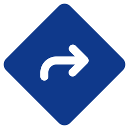

<div align="center">

  
  <h1>Traffic sign object detection</h1>

  <p>
    A website to detect traffic signs
  </p>

<!-- Badges -->
<p>
  <a href="https://github.com/DuckyMomo20012/traffic-sign-detection/graphs/contributors">
    
  </a>
  <a href="">
    
  </a>
  <a href="https://github.com/DuckyMomo20012/traffic-sign-detection/network/members">
    
  </a>
  <a href="https://github.com/DuckyMomo20012/traffic-sign-detection/stargazers">
    
  </a>
  <a href="https://github.com/DuckyMomo20012/traffic-sign-detection/issues/">
    
  </a>
  <a href="https://github.com/DuckyMomo20012/traffic-sign-detection/blob/main/LICENSE">
    
  </a>
</p>

<h4>
    <a href="https://github.com/DuckyMomo20012/traffic-sign-detection/">View Demo</a>
  <span> · </span>
    <a href="https://github.com/DuckyMomo20012/traffic-sign-detection">Documentation</a>
  <span> · </span>
    <a href="https://github.com/DuckyMomo20012/traffic-sign-detection/issues/">Report Bug</a>
  <span> · </span>
    <a href="https://github.com/DuckyMomo20012/traffic-sign-detection/issues/">Request Feature</a>
  </h4>
</div>

<br />

<!-- Table of Contents -->

# :notebook_with_decorative_cover: Table of Contents

- [About the Project](#star2-about-the-project)
  - [Screenshots](#camera-screenshots)
  - [Tech Stack](#space_invader-tech-stack)
  - [Features](#dart-features)
- [Getting Started](#toolbox-getting-started)
  - [Prerequisites](#bangbang-prerequisites)
  - [Run Locally](#running-run-locally)
- [Usage](#eyes-usage)
- [Training](#rocket-training)
- [Roadmap](#compass-roadmap)
- [Contributing](#wave-contributing)
  - [Code of Conduct](#scroll-code-of-conduct)
- [FAQ](#grey_question-faq)
- [License](#warning-license)
- [Contact](#handshake-contact)
- [Acknowledgements](#gem-acknowledgements)

<!-- About the Project -->

## :star2: About the Project

<!-- Screenshots -->

### :camera: Screenshots

<div align="center">
  
</div>

<!-- TechStack -->

### :space_invader: Tech Stack

<details>
  <summary>Client</summary>
  <ul>
    <li><a href="https://www.javascript.com/">Javascript</a></li>
    <li><a href="https://reactjs.org/">React.js</a></li>
    <li><a href="https://reactrouter.com/">React Router</a></li>
    <li><a href="https://redux-toolkit.js.org/">Redux Toolkit</a></li>
    <li><a href="https://windicss.org/">WindiCSS</a></li>
    <li><a href="https://mantine.dev/">Mantine</a></li>
    <li><a href="https://eslint.org/">ESLint</a></li>
    <li><a href="https://prettier.io/">Prettier</a></li>
    <li><a href="https://vitejs.dev/">Vite</a></li>
    <li><a href="https://iconify.design/">Iconify</a></li>
  </ul>
</details>

<details>
  <summary>Server</summary>
  <ul>
    <li><a href="https://expressjs.com/">Express.js</a></li>
    <li><a href="https://socket.io/">SocketIO</a></li>
    <li><a href="https://fastapi.tiangolo.com/">FastAPI</a></li>
    <li><a href="https://github.com/ultralytics/yolov5">YOLOv5</a></li>
  </ul>
</details>

<!-- Features -->

### :dart: Features

- Detect traffic sign objects:
  - Using uploaded images.
  - Using URLs.
- Save the results as a `.zip` file.

<!-- Getting Started -->

## :toolbox: Getting Started

<!-- Prerequisites -->

### :bangbang: Prerequisites

- Python: `>= 3.9`.

- This project uses [Yarn](https://yarnpkg.com/) as package manager:

  ```bash
  npm install --global yarn
  ```

- This project uses [Poetry](https://python-poetry.org/) as package manager:

  Linux, macOS, Windows (WSL)

  ```bash
  curl -sSL https://install.python-poetry.org | python3 -
  ```

  Read more about installation on
  [Poetry documentation](https://python-poetry.org/docs/master/#installation).

- To run the script, you need to install [zx](https://github.com/google/zx)
  tool:

  **Requirement**: Node version >= 16.0.0

  ```bash
  npm install --global zx
  ```

<!-- Run Locally -->

### :running: Run Locally

Clone the project:

```bash
git clone https://github.com/DuckyMomo20012/traffic-sign-detection.git
```

Go to the project directory:

```bash
cd traffic-sign-detection
```

Install dependencies:

- **web:**

  ```bash
  cd ./web
  yarn
  ```

- **app:**

  ```bash
  cd ./app
  yarn
  ```

- **yolo:**

  Install dependencies with `Poetry`:

  ```bash
  cd ./yolo
  poetry install
  ```

Running script to start the server:

- **Windows:**

  ```console
  run.bat
  ```

- **Linux:** Requires zx tool to be installed.

  ```bash
  chmod +x ./run.mjs
  ./run.mjs
  ```

Start server manually:

> **Note**: `web`, `app`, and `yolo` needs to be **run concurrently**.

- **web:**

  ```bash
  cd ./web
  yarn dev
  ```

- **app:**

  ```bash
  cd ./app
  yarn dev
  ```

- **yolo:**

  ```bash
  cd ./yolo
  poetry shell
  poe dev
  ```

<!-- Usage -->

## :eyes: Usage

- You can detect traffic sign objects using uploaded images or URLs.

  - Supports `.png`, `.jpg`, `.jpeg` and `.webp` images.

  - Upload images:

    - Maximum 3 images per request.
    - Drag and drop image files to the Dropzone field.
    - Click on the Dropzone field to open the file browser.

      > **Note**: On Linux, you will have some issues when clicking to open the
      > file browser.

  - Image URLs:

    - Maximum 3 URLs per request.
    - The Textarea field will check for **invalid** or **duplicate** URLs.

- It usually takes about 1-2 minutes to detect the traffic signs.

- You can download the results as a `.zip` file or download each image manually.

- Detect up to **36** traffic signs:

  <details>
  <summary>List</summary>

  ```
  - Cycle Zone
  - Danger Ahead
  - Deer Zone
  - End of Right Road Go straight
  - Give Way
  - Go Left or Straight
  - Go Right or Straight
  - Go Straight
  - Huddle Road
  - Left Curve Ahead
  - Left Sharp Curve
  - No Entry
  - No Over Taking Trucks
  - No Over Taking
  - No Stopping
  - No Waiting
  - Pedestrian
  - Right Curve Ahead
  - Right Sharp Curve
  - Road Work
  - RoundAbout
  - Slippery Road
  - Snow Warning Sign
  - Speed Limit 100
  - Speed Limit 120
  - Speed Limit 20
  - Speed Limit 30
  - Speed Limit 50
  - Speed Limit 60
  - Speed Limit 70
  - Speed Limit 80
  - Stop
  - Traffic Signals Ahead
  - Truck Sign
  - Turn Left
  - Turn Right
  ```

  </details>

> **Note**: If you want to detect using other models, you can rename the model
> file to `best.pt` and copy it to the folder `yolo/model/`.

<!-- Training -->

## :rocket: Training

Please go to folder [training](training/) and read the `README.md` file.

<!-- Roadmap -->

## :compass: Roadmap

- [x] Fix server writing file problem.
- [x] Fix fixed model and image name problem.
- [x] Fix fixed uploading model problem.
- [x] Update UI.
- [ ] Improve model for detection.
- [ ] Video support.

<!-- Contributing -->

## :wave: Contributing

<a href="https://github.com/DuckyMomo20012/traffic-sign-detection/graphs/contributors">
  
</a>

Contributions are always welcome!

<!-- Code of Conduct -->

### :scroll: Code of Conduct

Please read the [Code of Conduct](https://github.com/DuckyMomo20012/traffic-sign-detection/blob/main/CODE_OF_CONDUCT.md).

<!-- FAQ -->

## :grey_question: FAQ

- Is this project still maintained?

  - Yes, but I will only update documentation.

- Why do you have to setup Express server between client and YOLOv5 server?

  - This project was first structured using Express as SSR server, it will open
    a `child_process` to run the detection using Python code. I just don't want
    to change the structure too much.

- Why does you limit the number of images per request to 3 for both image upload
  and image URLs?

  - We haven't optimize the code for better performance. So, we have to limit
    the number of images per request to 3.

- Can I upload my model file to the server?

  - No, you can't. Because the model is loaded ONE TIME by the server when the
    server starts, update the model might conflicts with other users.

- Why does the server only accept `.png`, `.jpg`, `.jpeg` or `.webp` images?

  - YOLOv5 supports many image extensions: `.bmp`, `.jpg`, `.jpeg`, `.png`,
    `.tif`, `.tiff`, `.dng`, `.webp`, `.mpo`. But for **security reasons**, we
    only accept `.png`, `.jpg`, `.jpeg` and `.webp` images.

- I have issues when installing `yolo` dependencies. How can I fix it?

  - DO NOT press `CTRL + C` when installing dependencies.
  - To fix the issue, you will have to remove the folder `.venv` and file
    `poetry.lock`. Then run these commands and reinstall the dependencies:

    ```bash
    rm -rf ~/.cache/pypoetry/cache/
    rm -rf ~/.cache/pypoetry/artifacts/
    ```

<!-- License -->

## :warning: License

Distributed under Apache-2.0 license. See
[LICENSE](https://github.com/DuckyMomo20012/traffic-sign-detection/blob/main/LICENSE)
for more information.

<!-- Contact -->

## :handshake: Contact

Duong Vinh - [@duckymomo20012](https://twitter.com/duckymomo20012) -
tienvinh.duong4@gmail.com

Project Link: [https://github.com/DuckyMomo20012/traffic-sign-detection](https://github.com/DuckyMomo20012/traffic-sign-detection).

<!-- Acknowledgments -->

## :gem: Acknowledgements

Here are useful resources and libraries that we have used in our projects:

- [YOLOv5](https://github.com/ultralytics/yolov5): YOLOv5 rocket is a family of
  object detection architectures and models pretrained on the COCO dataset, and
  represents Ultralytics open-source research into future vision AI methods,
  incorporating lessons learned and best practices evolved over thousands of
  hours of research and development.
- [Awesome Readme Template](https://github.com/Louis3797/awesome-readme-template):
  A detailed template to bootstrap your README file quickly.
